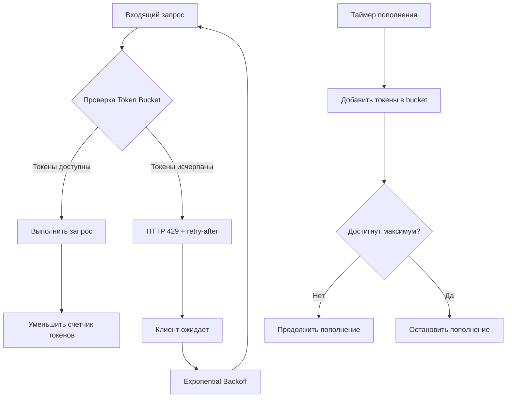
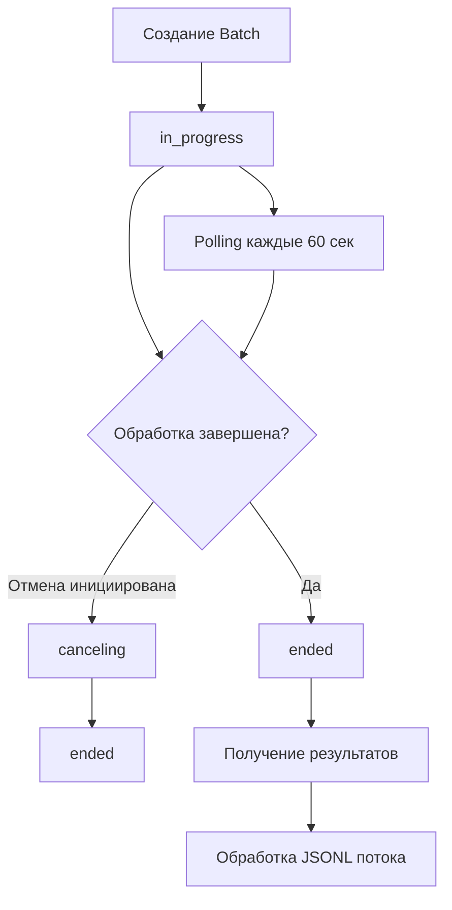
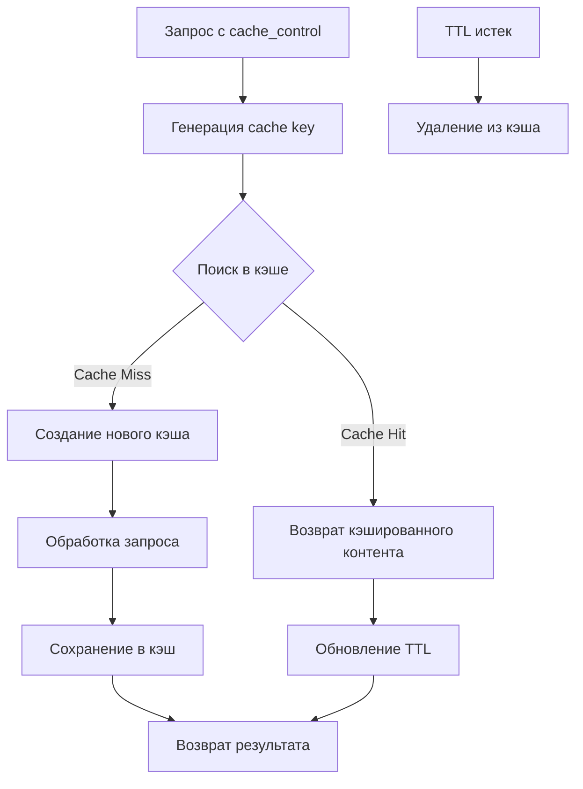
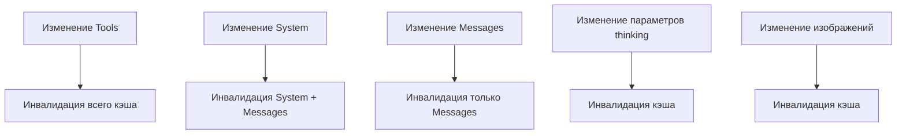
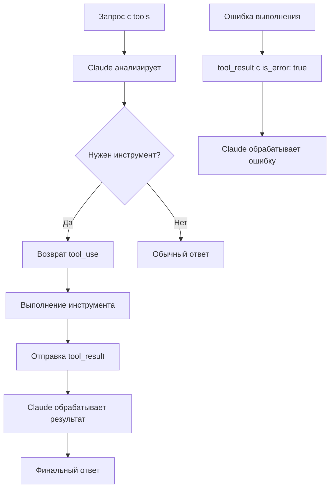

# Технические руководства Claude API v2.0

> **Последнее обновление**: Декабрь 2024  
> **Версия API**: 2023-06-01  
> **Статус**: Prompt caching теперь общедоступен (не требует бета-заголовков)

## ⚠️ Важные изменения

- **Prompt Caching**: Теперь общедоступен, бета-заголовки больше не требуются
- **Устаревшие модели**: Claude Sonnet 3.5 (20240620 и 20241022) будут удалены 22 октября 2025
- **Batch API + Caching**: Кэш-хиты предоставляются на основе best-effort из-за асинхронной природы
- **Порядок результатов**: Результаты батчей могут возвращаться в произвольном порядке

---

## 1. Управление лимитами Claude API

### Технические спецификации лимитов

#### Алгоритм Rate Limiting

- **Алгоритм**: Token Bucket Algorithm с непрерывным пополнением токенов
- **Важное ограничение**: Короткие всплески запросов могут превышать лимит даже при соблюдении
  минутных ограничений



#### Точные численные лимиты по уровням

**Tier 1 ($5+ депозит, $100 месячный лимит):**

```
Все модели: 50 RPM
Claude Sonnet 4: 30,000 ITPM | 8,000 OTPM
Claude Opus 4: 20,000 ITPM | 8,000 OTPM
Claude Haiku 3.5: 50,000* ITPM | 10,000 OTPM
```

**Tier 2 ($40+ депозит, $500 месячный лимит):**

```
Все модели: 1,000 RPM
Claude Sonnet 4: 450,000 ITPM | 90,000 OTPM
Claude Opus 4: 40,000 ITPM | 16,000 OTPM
Claude Haiku 3.5: 100,000* ITPM | 20,000 OTPM
```

**Tier 3 ($200+ депозит, $1,000 месячный лимит):**

```
Все модели: 2,000 RPM
Claude Sonnet 4: 800,000 ITPM | 160,000 OTPM
Claude Opus 4: 80,000 ITPM | 32,000 OTPM
```

**Tier 4 ($400+ депозит, $5,000 месячный лимит):**

```
Все модели: 4,000 RPM
Claude Sonnet 4: 2,000,000 ITPM | 400,000 OTPM
Claude Opus 4: 200,000 ITPM | 80,000 OTPM
```

### Структуры данных для мониторинга

#### HTTP заголовки лимитов

```python
headers_mapping = {
    'anthropic-ratelimit-requests-limit': 'Максимум запросов в период',
    'anthropic-ratelimit-requests-remaining': 'Оставшиеся запросы',
    'anthropic-ratelimit-requests-reset': 'RFC 3339 время сброса',
    'anthropic-ratelimit-tokens-limit': 'Максимум токенов в период',
    'anthropic-ratelimit-tokens-remaining': 'Оставшиеся токены (округлено до тысяч)',
    'anthropic-ratelimit-tokens-reset': 'RFC 3339 время сброса токенов',
    'anthropic-ratelimit-input-tokens-limit/remaining/reset': 'Входные токены',
    'anthropic-ratelimit-output-tokens-limit/remaining/reset': 'Исходные токены',
    'retry-after': 'Секунды до следующего разрешенного запроса'
}
```

### Реализация retry-логики

#### Python: Exponential Backoff с Jitter

```python
import time
import random
import anthropic

def call_claude_api_with_backoff(prompt, max_retries=5, base_delay=1):
    client = anthropic.Anthropic(api_key="your_api_key")
    retries = 0

    while retries <= max_retries:
        try:
            response = client.messages.create(
                model="claude-sonnet-4-20250514",
                max_tokens=1000,
                messages=[{"role": "user", "content": prompt}]
            )
            return response.content
        except Exception as e:
            if "429" in str(e) and retries < max_retries:
                # Exponential backoff with jitter
                delay = base_delay * (2 ** retries) + random.uniform(0, 0.5)
                print(f"Rate limited. Retrying in {delay:.2f} seconds...")
                time.sleep(delay)
                retries += 1
            else:
                raise

    raise Exception("Max retries exceeded")
```

#### Token Bucket Implementation

```python
import time
import threading

class TokenBucket:
    def __init__(self, tokens_per_second, max_tokens):
        self.tokens_per_second = tokens_per_second
        self.max_tokens = max_tokens
        self.tokens = max_tokens
        self.last_refill = time.time()
        self.lock = threading.Lock()

    def _refill_tokens(self):
        now = time.time()
        elapsed = now - self.last_refill
        new_tokens = elapsed * self.tokens_per_second
        self.tokens = min(self.max_tokens, self.tokens + new_tokens)
        self.last_refill = now

    def get_token(self):
        with self.lock:
            self._refill_tokens()
            if self.tokens >= 1:
                self.tokens -= 1
                return True
            return False
```

### Обработка ошибок

#### Коды состояний HTTP

- **429**: "Too Many Requests" - превышение rate limit
- **413**: "Request Too Large" - превышение размера запроса
- **500**: Внутренняя ошибка сервера Anthropic
- **529**: Перегрузка API (временная)

#### Специфические сообщения об ошибках 429

```python
error_handlers = {
    "Number of request tokens has exceeded your per-minute rate limit": "ITPM_EXCEEDED",
    "Number of request tokens has exceeded your daily rate limit": "DAILY_LIMIT_EXCEEDED",
    "Number of requests has exceeded your per-minute rate limit": "RPM_EXCEEDED",
    "Quota exceeded": "QUOTA_EXCEEDED"  # Claude на Google Cloud
}
```

### Оптимизация производительности

#### Multi-Key Load Balancing

```python
class APIKeyManager:
    def __init__(self, api_keys, requests_per_day_per_key):
        self.api_keys = {}
        self.lock = threading.Lock()

        for key in api_keys:
            self.api_keys[key] = {
                'key': key,
                'daily_limit': requests_per_day_per_key,
                'used_today': 0,
                'last_reset': datetime.now().date(),
                'available': True
            }

    def get_available_key(self):
        with self.lock:
            self._reset_daily_counters()

            available_keys = [
                key_info for key_info in self.api_keys.values()
                if key_info['available'] and
                   key_info['used_today'] < key_info['daily_limit']
            ]

            if not available_keys:
                return None

            # Select key with fewest used requests
            selected_key = min(available_keys, key=lambda k: k['used_today'])
            selected_key['used_today'] += 1

            return selected_key['key']
```

### 5. Streaming поддержка в TypeScript

```typescript
import Anthropic from '@anthropic-ai/sdk';

const client = new Anthropic({
  apiKey: process.env['ANTHROPIC_API_KEY'],
});

// Streaming для обычных запросов (НЕ поддерживается в батчах)
const stream = await client.messages.create({
  max_tokens: 1024,
  messages: [{ role: 'user', content: 'Hello, Claude' }],
  model: 'claude-sonnet-4-20250514',
  stream: true,
});

for await (const messageStreamEvent of stream) {
  console.log(messageStreamEvent.type);

  if (messageStreamEvent.type === 'content_block_delta') {
    // Обработка частичного контента
    process.stdout.write(messageStreamEvent.delta.text);
  }
}
```

### 6. Корректная типизация с использованием встроенных типов SDK

```typescript
import Anthropic from '@anthropic-ai/sdk';

const client = new Anthropic({
  apiKey: process.env['ANTHROPIC_API_KEY'],
});

// Использование встроенных типов для параметров
const params: Anthropic.MessageCreateParams = {
  max_tokens: 1024,
  messages: [{ role: 'user', content: 'Hello, Claude' }],
  model: 'claude-sonnet-4-20250514',
};

// Для батчей
const batchParams: Anthropic.MessageBatchCreateParams = {
  requests: [
    {
      custom_id: 'request-1',
      params: {
        model: 'claude-sonnet-4-20250514',
        max_tokens: 1024,
        messages: [{ role: 'user', content: 'Hello' }],
      },
    },
  ],
};
```

---

## 2. Пакетная обработка (Message Batches API)

### Технические спецификации

#### API Endpoints

| Операция              | HTTP Method | Endpoint                                  | Описание                                |
| --------------------- | ----------- | ----------------------------------------- | --------------------------------------- |
| Создание батча        | `POST`      | `/v1/messages/batches`                    | Создание нового message batch           |
| Получение батча       | `GET`       | `/v1/messages/batches/{batch_id}`         | Получение информации о батче            |
| Список батчей         | `GET`       | `/v1/messages/batches`                    | Получение списка всех батчей            |
| Отмена батча          | `POST`      | `/v1/messages/batches/{batch_id}/cancel`  | Отмена обработки батча                  |
| Удаление батча        | `DELETE`    | `/v1/messages/batches/{batch_id}`         | Удаление завершенного батча             |
| Получение результатов | `GET`       | `/v1/messages/batches/{batch_id}/results` | Потоковое получение результатов в JSONL |

#### Лимиты пакетной обработки

```
Tier 1: 50 RPM | 100,000 batch requests в очереди
Tier 2: 50 RPM | 100,000 batch requests в очереди
Tier 3: 1,000 RPM | 200,000 batch requests в очереди
Tier 4: 2,000 RPM | 300,000 batch requests в очереди
Enterprise: 4,000 RPM | 500,000 batch requests в очереди
```

### Структуры данных

#### Поддерживаемые модели для Message Batches API

```
Актуальные модели:
- Claude Opus 4.1 (claude-opus-4-1-20250805)
- Claude Opus 4 (claude-opus-4-20250514)
- Claude Sonnet 4 (claude-sonnet-4-20250514)
- Claude Sonnet 3.7 (claude-3-7-sonnet-20250219)
- Claude Haiku 3.5 (claude-3-5-haiku-20241022)
- Claude Haiku 3 (claude-3-haiku-20240307)

⚠️ Устаревшие модели (будут удалены 22 октября 2025):
- Claude Sonnet 3.5 (claude-3-5-sonnet-20240620)
- Claude Sonnet 3.5 (claude-3-5-sonnet-20241022)
```

#### JSON схема создания batch

```json
{
  "requests": [
    {
      "custom_id": "string",
      "params": {
        "model": "claude-sonnet-4-20250514|claude-opus-4-20250514|...",
        "max_tokens": "integer >= 1",
        "messages": [
          {
            "role": "user|assistant",
            "content": "string|array"
          }
        ],
        "system": "string",
        "temperature": "number [0,2]",
        "top_k": "integer",
        "top_p": "number [0,1]",
        "stop_sequences": ["string"],
        "stream": false,
        "metadata": {
          "user_id": "string"
        },
        "tools": [],
        "tool_choice": {}
      }
    }
  ]
}
```

#### Схема ответа batch

```json
{
  "id": "msgbatch_013Zva2CMHLNnXjNJJKqJ2EF",
  "type": "message_batch",
  "processing_status": "in_progress|canceling|ended",
  "request_counts": {
    "processing": "integer",
    "succeeded": "integer",
    "errored": "integer",
    "canceled": "integer",
    "expired": "integer"
  },
  "ended_at": "RFC3339|null",
  "created_at": "RFC3339",
  "expires_at": "RFC3339",
  "cancel_initiated_at": "RFC3339|null",
  "results_url": "string|null",
  "archived_at": "RFC3339|null"
}
```

### Реализация

#### Жизненный цикл batch



#### TypeScript: Создание и обработка batch

```typescript
import Anthropic from '@anthropic-ai/sdk';

const client = new Anthropic({
  apiKey: process.env['ANTHROPIC_API_KEY'], // По умолчанию, можно опустить
});

// Создание batch
const messageBatch = await client.messages.batches.create({
  requests: [
    {
      custom_id: 'request-1',
      params: {
        model: 'claude-sonnet-4-20250514',
        max_tokens: 1024,
        messages: [{ role: 'user', content: 'Hello, world' }],
      },
    },
    {
      custom_id: 'request-2',
      params: {
        model: 'claude-sonnet-4-20250514',
        max_tokens: 1024,
        messages: [{ role: 'user', content: 'Hi again, friend' }],
      },
    },
  ],
});

// Polling для завершения
let batch = messageBatch;
while (batch.processing_status !== 'ended') {
  console.log('Batch is still processing...');
  await new Promise((resolve) => setTimeout(resolve, 60000)); // 60 секунд
  batch = await client.messages.batches.retrieve(messageBatch.id);
}

// Получение результатов
const results = await client.messages.batches.results(messageBatch.id);
for await (const entry of results) {
  if (entry.result.type === 'succeeded') {
    console.log(`Request ${entry.custom_id}:`, entry.result.message.content);
  } else if (entry.result.type === 'errored') {
    console.log(`Request ${entry.custom_id} failed:`, entry.result.error);
  }
}
```

#### Python: Создание и обработка batch

```python
import anthropic
from anthropic.types.message_create_params import MessageCreateParamsNonStreaming
from anthropic.types.messages.batch_create_params import Request

client = anthropic.Anthropic()

# Создание batch
message_batch = client.messages.batches.create(
    requests=[
        Request(
            custom_id="request-1",
            params=MessageCreateParamsNonStreaming(
                model="claude-sonnet-4-20250514",
                max_tokens=1024,
                messages=[{"role": "user", "content": "Hello, world"}]
            )
        ),
        Request(
            custom_id="request-2",
            params=MessageCreateParamsNonStreaming(
                model="claude-sonnet-4-20250514",
                max_tokens=1024,
                messages=[{"role": "user", "content": "Hi again, friend"}]
            )
        )
    ]
)

# Polling для завершения
import time

while True:
    message_batch = client.messages.batches.retrieve(message_batch.id)
    if message_batch.processing_status == "ended":
        break
    print(f"Batch is still processing...")
    time.sleep(60)

# Получение результатов
for result in client.messages.batches.results(message_batch.id):
    if result.result.type == "succeeded":
        print(f"Request {result.custom_id}: {result.result.message.content}")
    elif result.result.type == "errored":
        print(f"Request {result.custom_id} failed: {result.result.error}")
```

````

### Обработка ошибок

#### Статусы результатов батча
| Состояние | Описание | Действие |
|-----------|----------|----------|
| `processing` | Запросы в процессе обработки | Ожидание |
| `succeeded` | Успешно обработанные запросы | Извлечение результатов |
| `errored` | Запросы с ошибками | Анализ и retry |
| `canceled` | Отмененные запросы | Повторная отправка |
| `expired` | Истекшие запросы (>24ч) | Обязательная повторная отправка |

⚠️ **Важно**: Результаты батча могут возвращаться в любом порядке, не обязательно в том порядке, в котором были отправлены запросы. Используйте `custom_id` для идентификации каждого результата.

#### Пример обработки результатов в произвольном порядке
```json
{"custom_id":"my-second-request","result":{"type":"succeeded","message":{...}}}
{"custom_id":"my-first-request","result":{"type":"succeeded","message":{...}}}
````

#### Алгоритм обработки результатов

```python
def process_batch_results(client, batch_id):
    results = []
    retry_requests = []

    for result in client.messages.batches.results(batch_id):
        if result.result.type == "succeeded":
            message = result.result.message
            results.append({
                'custom_id': result.custom_id,
                'content': message.content[0].text,
                'tokens_used': message.usage.input_tokens + message.usage.output_tokens
            })

        elif result.result.type == "errored":
            error = result.result.error
            if error.type in ["overloaded_error", "rate_limit_error"]:
                retry_requests.append(result.custom_id)
            print(f"Error in {result.custom_id}: {error.message}")

        elif result.result.type == "expired":
            retry_requests.append(result.custom_id)
            print(f"Request {result.custom_id} expired - retry needed")

    return results, retry_requests
```

### Оптимизация производительности

#### Лимиты системы

- **Максимальный размер batch:** 100,000 запросов ИЛИ 256 MB
- **Время обработки:** до 24 часов (большинство завершается менее чем за 1 час)
- **Доступность результатов:** 29 дней после создания
- **Стоимость:** 50% от стандартных цен API
- **Изоляция по Workspace:** Батчи доступны только в том Workspace, где они были созданы
- **Поддержка функций:** Все функции Messages API, включая бета-функции (кроме streaming)
- **Совместимость с prompt caching:** Можно использовать вместе для дополнительной экономии

#### Batch с Prompt Caching

⚠️ **Важное ограничение**: При использовании prompt caching с батчами, кэш-хиты предоставляются на
основе "наилучших усилий" (best-effort) из-за асинхронной природы батч-запросов
[(1)](https://docs.anthropic.com/en/docs/build-with-claude/prompt-caching#faq).

### Что означает "best-effort" кэш-хиты

**Best-effort** означает, что система не гарантирует использование кэша для каждого запроса, даже
если кэшированный контент доступен. Это происходит по следующим причинам:

1. **Параллельная обработка**: Когда несколько запросов с одинаковым кэшируемым контентом
   обрабатываются одновременно, только первый может создать кэш, а остальные не смогут его
   использовать [(1)](https://docs.anthropic.com/en/docs/build-with-claude/prompt-caching#faq).

2. **Непредсказуемый порядок выполнения**: Запросы в батче могут выполняться не в том порядке, в
   котором они были отправлены. Это означает, что запрос, который должен был использовать кэш, может
   выполниться раньше запроса, создающего этот кэш
   [(1)](https://docs.anthropic.com/en/docs/build-with-claude/prompt-caching#faq).

### Оптимальная стратегия для максимизации кэш-хитов

Для наиболее эффективного использования кэша с батчами рекомендуется двухэтапный подход
[(1)](https://docs.anthropic.com/en/docs/build-with-claude/prompt-caching#faq):

1. **Создание кэша**: Отправить батч с одним запросом, содержащим общий префикс с 1-часовым кэшем
2. **Дождаться завершения**: Мониторить выполнение первого батча
3. **Основные запросы**: После завершения отправить остальные запросы, которые будут использовать
   созданный кэш

```python
# Шаг 1: Создание кэша
cache_primer_batch = client.messages.batches.create(
    requests=[{
        "custom_id": "cache-primer",
        "params": {
            "model": "claude-sonnet-4-20250514",
            "max_tokens": 100,
            "system": [{
                "type": "text",
                "text": shared_context,
                "cache_control": {"type": "ephemeral"}
            }],
            "messages": [{"role": "user", "content": "Инициализация кэша"}]
        }
    }]
)

# Шаг 2: Ожидание завершения
while cache_primer_batch.processing_status != 'ended':
    time.sleep(60)
    cache_primer_batch = client.messages.batches.retrieve(cache_primer_batch.id)

# Шаг 3: Основные запросы с использованием кэша
main_requests = []
for i, question in enumerate(questions):
    main_requests.append({
        "custom_id": f"question-{i}",
        "params": {
            "model": "claude-sonnet-4-20250514",
            "max_tokens": 1024,
            "system": [{
                "type": "text",
                "text": shared_context,
                "cache_control": {"type": "ephemeral"}
            }],
            "messages": [{"role": "user", "content": question}]
        }
    })

main_batch = client.messages.batches.create({"requests": main_requests})
```

Этот подход эффективнее использования 5-минутного кэша, поскольку батч-запросы обычно выполняются от
5 минут до 1 часа [(1)](https://docs.anthropic.com/en/docs/build-with-claude/prompt-caching#faq).

```python
# ❌ НЕОПТИМАЛЬНЫЙ подход: Все запросы в одном батче
# Может привести к низкой эффективности кэша (30-50% cache hit rate)

requests = []
shared_context = "Very long document text here..."

for i, question in enumerate(questions):
    requests.append(Request(
        custom_id=f"question-{i}",
        params=MessageCreateParamsNonStreaming(
            model="claude-sonnet-4-20250514",
            max_tokens=1024,
            messages=[
                {
                    "role": "user",
                    "content": [
                        {
                            "type": "text",
                            "text": shared_context,
                            "cache_control": {"type": "ephemeral"}
                        },
                        {
                            "type": "text",
                            "text": question
                        }
                    ]
                }
            ]
        )
    ))

# Отправка всех запросов сразу - кэш может работать неэффективно
batch = client.messages.batches.create({"requests": requests})

```

```python
# ✅ ОПТИМАЛЬНЫЙ подход: Двухэтапное кэширование
# Обеспечивает максимальную эффективность кэша (до 98% cache hit rate)

import time

shared_context = "Very long document text here..."

# Этап 1: Создание кэша
cache_primer_request = Request(
    custom_id="cache-primer",
    params=MessageCreateParamsNonStreaming(
        model="claude-sonnet-4-20250514",
        max_tokens=100,
        messages=[
            {
                "role": "user",
                "content": [
                    {
                        "type": "text",
                        "text": shared_context,
                        "cache_control": {"type": "ephemeral"}
                    },
                    {
                        "type": "text",
                        "text": "Инициализация кэша"
                    }
                ]
            }
        ]
    )
)

# Отправка запроса для создания кэша
cache_batch = client.messages.batches.create({"requests": [cache_primer_request]})

# Этап 2: Ожидание завершения создания кэша
while True:
    cache_batch = client.messages.batches.retrieve(cache_batch.id)
    if cache_batch.processing_status == "ended":
        print("Кэш создан и готов к использованию")
        break
    print("Создание кэша в процессе...")
    time.sleep(60)

# Этап 3: Основные запросы с использованием готового кэша
main_requests = []
for i, question in enumerate(questions):
    main_requests.append(Request(
        custom_id=f"question-{i}",
        params=MessageCreateParamsNonStreaming(
            model="claude-sonnet-4-20250514",
            max_tokens=1024,
            messages=[
                {
                    "role": "user",
                    "content": [
                        {
                            "type": "text",
                            "text": shared_context,
                            "cache_control": {"type": "ephemeral"}
                        },
                        {
                            "type": "text",
                            "text": question
                        }
                    ]
                }
            ]
        )
    ))

# Отправка основных запросов - высокая вероятность cache hit
main_batch = client.messages.batches.create({"requests": main_requests})
```

### Сравнение подходов

| Подход      | Cache Hit Rate | Время выполнения | Сложность | Когда использовать                                   |
| ----------- | -------------- | ---------------- | --------- | ---------------------------------------------------- |
| Одноэтапный | 30-50%         | Быстрее          | Простой   | Для небольших батчей или когда время важнее экономии |
| Двухэтапный | 80-98%         | Медленнее        | Сложнее   | Для больших батчей с дорогим shared context          |

**Рекомендация**: Используйте двухэтапный подход, когда shared context превышает 10,000 токенов и у
вас более 10 запросов в батче
[(1)](https://docs.anthropic.com/en/docs/build-with-claude/prompt-caching#how-to-implement-prompt-caching).

#### cURL пример батча с кэшированием

```bash
curl https://api.anthropic.com/v1/messages/batches \
     --header "x-api-key: $ANTHROPIC_API_KEY" \
     --header "anthropic-version: 2023-06-01" \
     --header "content-type: application/json" \
     --data '{
    "requests": [
        {
            "custom_id": "my-first-request",
            "params": {
                "model": "claude-opus-4-20250514",
                "max_tokens": 1024,
                "system": [
                    {
                        "type": "text",
                        "text": "You are an AI assistant tasked with analyzing literary works."
                    },
                    {
                        "type": "text",
                        "text": "<the entire contents of Pride and Prejudice>",
                        "cache_control": {"type": "ephemeral"}
                    }
                ],
                "messages": [
                    {
                        "role": "user",
                        "content": "Analyze the major themes in Pride and Prejudice."
                    }
                ]
            }
        }
    ]
}'
```

---

## 3. Кэширование промптов

### Технические спецификации кэширования

⚠️ **Важно**: Prompt caching теперь общедоступен и не требует бета-заголовков. Функция работает
автоматически при использовании `cache_control` параметра.

#### Алгоритм кэширования



#### Характеристики производительности

- **Экономия токенов**: До 90% сокращения затрат на input tokens
- **Сокращение латентности**: До 85% сокращения времени ответа для длинных промптов
- **Time to First Token (TTFT)**: Значительное сокращение для кэшированного контента

#### Ограничения размера кэша

- **Минимальная длина**:
  - 1024 токена для Claude Opus 4, Sonnet 4, Sonnet 3.7, Sonnet 3.5, Opus 3
  - 2048 токенов для Claude Haiku 3.5 и Haiku 3
- **Максимальное количество breakpoints**: До 4 cache breakpoints на промпт
- **Автоматическое ограничение**: Проверка кэша в пределах ~20 блоков контента

### Структуры данных

#### Базовая структура кэширования

```json
{
  "model": "claude-opus-4-1-20250805",
  "max_tokens": 1024,
  "system": [
    {
      "type": "text",
      "text": "Системные инструкции",
      "cache_control": { "type": "ephemeral" }
    }
  ],
  "messages": [
    {
      "role": "user",
      "content": [
        {
          "type": "text",
          "text": "Большой документ или контекст",
          "cache_control": { "type": "ephemeral" }
        },
        {
          "type": "text",
          "text": "Динамический запрос пользователя"
        }
      ]
    }
  ]
}
```

### Реализация

#### Python SDK - Базовая реализация

```python
import anthropic

client = anthropic.Anthropic()

# Prompt caching теперь общедоступен - бета-заголовки НЕ нужны
response = client.messages.create(
    model="claude-opus-4-1-20250805",
    max_tokens=1024,
    system=[
        {
            "type": "text",
            "text": "Вы - анализатор документов",
            "cache_control": {"type": "ephemeral"}
        }
    ],
    messages=[
        {
            "role": "user",
            "content": [
                {
                    "type": "text",
                    "text": f"<document>{large_document}</document>",
                    "cache_control": {"type": "ephemeral"}
                },
                {
                    "type": "text",
                    "text": "Проанализируйте основные темы"
                }
            ]
        }
    ]
    # Без extra_headers - prompt caching работает автоматически
)
```

#### Многоуровневое кэширование

```python
response = client.messages.create(
    model="claude-opus-4-1-20250805",
    max_tokens=1024,
    tools=[
        {
            "name": "calculator",
            "description": "Калькулятор",
            "input_schema": {"type": "object"},
            "cache_control": {"type": "ephemeral"}  # Кэш инструментов
        }
    ],
    system=[
        {
            "type": "text",
            "text": "Системные инструкции",
            "cache_control": {"type": "ephemeral"}  # Кэш системы
        }
    ],
    messages=[
        {
            "role": "user",
            "content": [
                {
                    "type": "text",
                    "text": "Диалоговый контекст",
                    "cache_control": {"type": "ephemeral"}  # Кэш сообщений
                },
                {"type": "text", "text": "Новый запрос"}
            ]
        }
    ]
)
```

### Обработка ошибок

#### Политики TTL и выселения

- **5-минутный кэш**: TTL = 5 минут (по умолчанию), обновляется при каждом использовании
- **Кэш автоматически истекает**: без ручного управления
- **Политика обновления**: Кэш обновляется бесплатно при каждом использовании в течение TTL периода

#### Иерархия инвалидации кэша



### Оптимизация производительности

#### Мониторинг эффективности кэша

```python
# Анализ usage полей в response
usage = response.usage

cache_creation_tokens = usage.cache_creation_input_tokens  # Токены записи в кэш
cache_read_tokens = usage.cache_read_input_tokens         # Токены чтения из кэша
regular_input_tokens = usage.input_tokens                 # Обычные input токены
output_tokens = usage.output_tokens                       # Выходные токены

# Расчет эффективности кэша
cache_hit_rate = cache_read_tokens / (cache_read_tokens + regular_input_tokens)
cost_savings = 1 - (cache_read_tokens * 0.1 + regular_input_tokens) / (cache_read_tokens + regular_input_tokens)

print(f"Cache hit rate: {cache_hit_rate:.2%}")
print(f"Cost savings: {cost_savings:.2%}")
```

#### Стратегии оптимизации

1. **Структурирование промпта**: Размещайте статический контент в начале (tools → system → messages)
2. **Минимизация инвалидации**: Избегайте изменений в tool_choice параметрах
3. **Группировка по частоте изменений**: Разные уровни изменчивости на разных breakpoints
4. **Конкурентные запросы**: Дождитесь завершения первого ответа перед параллельными запросами

#### Ценообразование кэша

- **Запись в кэш**: 1.25x базовой цены input токенов
- **Чтение из кэша**: 0.1x базовой цены input токенов
- **Cache read токены**: Не учитываются в лимите ITPM
- **Автоматическое обновление TTL**: Бесплатно при каждом использовании

### Кэширование в батчах: особенности и ограничения

При совместном использовании prompt caching и Message Batches API важно понимать ограничения
[(1)](https://docs.anthropic.com/en/docs/build-with-claude/prompt-caching#faq):

- **Кэш-хиты на основе best-effort**: Из-за асинхронной и параллельной обработки батчей не все
  запросы смогут воспользоваться кэшем
- **Типичная эффективность**: Пользователи обычно получают от 30% до 98% кэш-хитов в зависимости от
  паттернов трафика [(1)](https://docs.anthropic.com/en/docs/build-with-claude/prompt-caching#faq)
- **Рекомендуемая стратегия**: Использование двухэтапного подхода с предварительным созданием кэша

```typescript
// TypeScript пример оптимизированного кэширования в батчах
const optimizedBatchCaching = async (sharedContext: string, questions: string[]) => {
  // Этап 1: Создание кэша
  const cacheSetup = await client.messages.batches.create({
    requests: [
      {
        custom_id: 'cache-setup',
        params: {
          model: 'claude-sonnet-4-20250514',
          max_tokens: 50,
          system: [
            {
              type: 'text',
              text: sharedContext,
              cache_control: { type: 'ephemeral' },
            },
          ],
          messages: [{ role: 'user', content: 'Создание кэша' }],
        },
      },
    ],
  });

  // Этап 2: Ожидание готовности кэша
  let batch = cacheSetup;
  while (batch.processing_status !== 'ended') {
    await new Promise((resolve) => setTimeout(resolve, 60000));
    batch = await client.messages.batches.retrieve(cacheSetup.id);
  }

  // Этап 3: Основные запросы
  const mainRequests = questions.map((question, i) => ({
    custom_id: `question-${i}`,
    params: {
      model: 'claude-sonnet-4-20250514',
      max_tokens: 1024,
      system: [
        {
          type: 'text',
          text: sharedContext,
          cache_control: { type: 'ephemeral' },
        },
      ],
      messages: [{ role: 'user', content: question }],
    },
  }));

  return await client.messages.batches.create({ requests: mainRequests });
};
```

---

## 4. Использование инструментов (Tools API)

### Технические спецификации

#### JSON схемы для определения инструментов

```json
{
  "name": "tool_name",
  "description": "Detailed description of what the tool does",
  "input_schema": {
    "type": "object",
    "properties": {
      "parameter_name": {
        "type": "string",
        "description": "Parameter description",
        "enum": ["option1", "option2"]
      }
    },
    "required": ["parameter_name"]
  }
}
```

#### Полная схема с типами данных

```json
{
  "name": "extract_data",
  "description": "Extract structured information from text",
  "input_schema": {
    "type": "object",
    "properties": {
      "searchQuery": {
        "type": "string",
        "description": "The search text query to use"
      },
      "typeFilter": {
        "type": "string",
        "description": "The type to filter on",
        "enum": ["location", "event", "person", "organization"]
      },
      "maxResults": {
        "type": "integer",
        "description": "Maximum number of results to return",
        "minimum": 1,
        "maximum": 100
      },
      "includeMetadata": {
        "type": "boolean",
        "description": "Whether to include metadata in results"
      },
      "tags": {
        "type": "array",
        "items": {
          "type": "string"
        },
        "description": "List of tags to apply"
      },
      "config": {
        "type": "object",
        "properties": {
          "confidence_threshold": {
            "type": "number",
            "minimum": 0.0,
            "maximum": 1.0
          }
        }
      }
    },
    "required": ["searchQuery"]
  }
}
```

### Структуры данных

#### Параметры tool_choice

```json
{"tool_choice": {"type": "auto"}}    // Позволяет Claude решать
{"tool_choice": {"type": "any"}}     // Принуждает использовать любой инструмент
{"tool_choice": {"type": "tool", "name": "get_weather"}}  // Принуждает конкретный инструмент
{"tool_choice": {"type": "none"}}    // Запрещает использование инструментов
```

#### Tool Use Response

```json
{
  "content": [
    {
      "type": "tool_use",
      "id": "toolu_12345",
      "name": "get_weather",
      "input": {
        "location": "San Francisco, CA",
        "unit": "fahrenheit"
      }
    }
  ],
  "stop_reason": "tool_use"
}
```

#### Tool Result Response

```json
{
  "role": "user",
  "content": [
    {
      "type": "tool_result",
      "tool_use_id": "toolu_12345",
      "content": "The weather in San Francisco is 68°F and sunny.",
      "is_error": false
    }
  ]
}
```

### Реализация

#### Процесс использования инструментов



#### Python с Pydantic для structured outputs

```python
from pydantic import BaseModel, Field
from anthropic import Anthropic
import json

class TextAnalysis(BaseModel):
    sentiment: str = Field(description="Overall sentiment (positive, negative, neutral)")
    main_topics: List[str] = Field(description="List of main topics")
    word_count: int = Field(description="Total word count")
    confidence_score: float = Field(description="Confidence level 0.0-1.0")

def analyze_text_with_claude(api_key: str, text: str) -> TextAnalysis:
    client = Anthropic(api_key=api_key)

    text_analysis_schema = TextAnalysis.model_json_schema()

    tools = [{
        "name": "build_text_analysis_result",
        "description": "Build the text analysis object",
        "input_schema": text_analysis_schema
    }]

    message = client.messages.create(
        model="claude-3-5-haiku-20241022",  # Используйте актуальные модели
        max_tokens=1200,
        temperature=0.2,
        system="You are analyzing text sentiment and topics.",
        messages=[{"role": "user", "content": text}],
        tools=tools,
        tool_choice={"type": "tool", "name": "build_text_analysis_result"}
    )

    function_call = message.content[0].input
    return TextAnalysis(**function_call)
```

#### TypeScript с Zod

```typescript
import { z } from 'zod';
import Anthropic from '@anthropic-ai/sdk';
import { zodToJsonSchema } from 'zod-to-json-schema';

const AnalysisSchema = z.object({
  inappropriate: z.boolean().describe('Whether content is inappropriate'),
  type: z
    .enum(['harassment', 'spam', 'violence', 'none'])
    .describe('Type of inappropriate content'),
  confidence: z.number().min(0).max(1).describe('Confidence score'),
  reasoning: z.string().describe('Explanation of the assessment'),
});

type Analysis = z.infer<typeof AnalysisSchema>;

class Model {
  private client: Anthropic;

  constructor(apiKey: string) {
    this.client = new Anthropic({ apiKey });
  }

  async call({ message, schema }: { message: string; schema: z.ZodSchema }): Promise<any> {
    const jsonSchema = zodToJsonSchema(schema);

    const response = await this.client.messages.create({
      model: 'claude-3-5-haiku-20241022', // Используйте актуальные модели
      max_tokens: 1000,
      tools: [
        {
          name: 'respond',
          description: 'Respond with structured analysis',
          input_schema: jsonSchema as any,
        },
      ],
      tool_choice: { type: 'tool', name: 'respond' },
      messages: [{ role: 'user', content: message }],
    });

    const toolUse = response.content.find((c) => c.type === 'tool_use');
    if (toolUse && toolUse.type === 'tool_use') {
      return toolUse.input;
    }
    throw new Error('No tool use found in response');
  }
}
```

### Обработка ошибок

#### Типы ошибок tool execution

```python
def handle_tool_errors(response):
    """Handle different types of tool execution errors"""

    if response.stop_reason == "max_tokens":
        raise ToolExecutionError("Response truncated due to max_tokens limit")

    if response.stop_reason == "tool_use":
        for content in response.content:
            if content.type == "tool_use":
                try:
                    validate_tool_input(content.input, tool_schema)
                    return content.input
                except ValidationError as e:
                    return send_tool_error(content.id, str(e))

    if response.stop_reason == "pause_turn":
        return continue_conversation(response)

    raise ToolExecutionError(f"Unexpected stop reason: {response.stop_reason}")
```

#### JSON Schema валидация

```python
import jsonschema
from jsonschema import validate, ValidationError

def validate_tool_input(input_data, schema):
    """Validate tool input against JSON schema"""
    try:
        validate(instance=input_data, schema=schema)
        return True
    except ValidationError as e:
        print(f"Validation error: {e.message}")
        print(f"Failed value: {e.instance}")
        print(f"Schema path: {e.absolute_path}")
        return False

# Обработка is_error в tool_result
error_response = {
    "role": "user",
    "content": [{
        "type": "tool_result",
        "tool_use_id": tool_use_id,
        "content": "Error: Invalid temperature range. Must be between -50 and 60 degrees.",
        "is_error": True
    }]
}
```

### Оптимизация производительности

#### Параллельные tool calls

```python
def optimize_tool_calls(client, messages, tools):
    """Optimize tool calls for better performance"""

    response = client.messages.create(
        model="claude-sonnet-4-20250514",
        max_tokens=4000,
        tools=tools,
        disable_parallel_tool_use=False,  # Разрешить параллельные вызовы
        messages=messages
    )

    # Обработка всех tool calls параллельно
    tool_results = []
    for content in response.content:
        if content.type == "tool_use":
            result = execute_tool_parallel(content.name, content.input)
            tool_results.append({
                "type": "tool_result",
                "tool_use_id": content.id,
                "content": result
            })

    return tool_results
```

#### Кэширование tool definitions

```python
# Использование prompt caching для часто используемых инструментов
cached_tools = [
    {
        "name": "get_weather",
        "description": "Get current weather information...",
        "input_schema": weather_schema,
        "cache_control": {"type": "ephemeral"}  # Кэшировать определение инструмента
    }
]
```

#### Токены использования по моделям

| Модель            | auto/none   | any/tool    |
| ----------------- | ----------- | ----------- |
| Claude Opus 4     | 346 токенов | 313 токенов |
| Claude Sonnet 4   | 346 токенов | 313 токенов |
| Claude Sonnet 3.7 | 346 токенов | 313 токенов |
| Claude Haiku 3.5  | 264 токена  | 340 токенов |

#### Anthropic-defined tools

```json
{
  "tools": [
    {
      "type": "web_search_20250305",
      "name": "web_search"
    },
    {
      "type": "text_editor_20250124",
      "name": "str_replace_editor"
    },
    {
      "type": "bash_20250124",
      "name": "bash"
    },
    {
      "type": "computer_20250124",
      "name": "computer",
      "display_width_px": 1024,
      "display_height_px": 768,
      "display_number": 1
    }
  ],
  "betas": ["computer-use-2025-01-24"]
}
```

---

## 📝 Дополнительные рекомендации для React/TypeScript

### 1. Типизация с Zod для батчей

```typescript
import { z } from 'zod';

const BatchRequestSchema = z.object({
  custom_id: z.string(),
  params: z.object({
    model: z.string(),
    max_tokens: z.number(),
    messages: z.array(
      z.object({
        role: z.enum(['user', 'assistant']),
        content: z.string(),
      }),
    ),
  }),
});

type BatchRequest = z.infer<typeof BatchRequestSchema>;

// Расширенная схема с опциональными параметрами
const ExtendedBatchRequestSchema = z.object({
  custom_id: z.string(),
  params: z.object({
    model: z.enum([
      'claude-opus-4-1-20250805',
      'claude-opus-4-20250514',
      'claude-sonnet-4-20250514',
      'claude-3-7-sonnet-20250219',
      'claude-3-5-haiku-20241022',
      'claude-3-haiku-20240307',
      // Модели claude-3-5-sonnet устарели и будут удалены в октябре 2025
    ]),
    max_tokens: z.number().min(1),
    messages: z.array(
      z.object({
        role: z.enum(['user', 'assistant']),
        content: z.union([
          z.string(),
          z.array(
            z.object({
              type: z.enum(['text', 'image']),
              text: z.string().optional(),
              source: z
                .object({
                  type: z.literal('base64'),
                  media_type: z.string(),
                  data: z.string(),
                })
                .optional(),
              cache_control: z
                .object({
                  type: z.literal('ephemeral'),
                })
                .optional(),
            }),
          ),
        ]),
      }),
    ),
    system: z
      .union([
        z.string(),
        z.array(
          z.object({
            type: z.literal('text'),
            text: z.string(),
            cache_control: z
              .object({
                type: z.literal('ephemeral'),
              })
              .optional(),
          }),
        ),
      ])
      .optional(),
    temperature: z.number().min(0).max(2).optional(),
    top_k: z.number().optional(),
    top_p: z.number().min(0).max(1).optional(),
    stop_sequences: z.array(z.string()).optional(),
    metadata: z
      .object({
        user_id: z.string(),
      })
      .optional(),
  }),
});

type ExtendedBatchRequest = z.infer<typeof ExtendedBatchRequestSchema>;
```

### 2. Обработка ошибок в React

```typescript
import React, { useState, useEffect } from 'react';
import Anthropic from '@anthropic-ai/sdk';

interface BatchResult {
  custom_id: string;
  status: 'succeeded' | 'errored' | 'canceled' | 'expired';
  content?: string;
  error?: string;
}

const BatchProcessor: React.FC = () => {
  const [results, setResults] = useState<BatchResult[]>([]);
  const [isProcessing, setIsProcessing] = useState(false);
  const client = new Anthropic({ apiKey: process.env.REACT_APP_ANTHROPIC_API_KEY! });

  const processBatchResults = async (batchId: string) => {
    try {
      const batchResults = await client.messages.batches.results(batchId);
      const processedResults: BatchResult[] = [];

      for await (const entry of batchResults) {
        let result: BatchResult;

        switch (entry.result.type) {
          case 'succeeded':
            // Успешные запросы
            result = {
              custom_id: entry.custom_id,
              status: 'succeeded',
              content: entry.result.message.content[0].type === 'text'
                ? entry.result.message.content[0].text
                : ''
            };
            break;

          case 'errored':
            // Запросы с ошибками
            result = {
              custom_id: entry.custom_id,
              status: 'errored',
              error: entry.result.error.message
            };
            console.error(`Error in ${entry.custom_id}:`, entry.result.error);
            break;

          case 'canceled':
            // Отмененные запросы
            result = {
              custom_id: entry.custom_id,
              status: 'canceled',
              error: 'Request was canceled'
            };
            break;

          case 'expired':
            // Истекшие запросы (>24 часа)
            result = {
              custom_id: entry.custom_id,
              status: 'expired',
              error: 'Request expired after 24 hours'
            };
            break;

          default:
            result = {
              custom_id: entry.custom_id,
              status: 'errored',
              error: 'Unknown status'
            };
        }

        processedResults.push(result);
      }

      setResults(processedResults);

      // Автоматический retry для истекших и отмененных запросов
      const retryRequests = processedResults
        .filter(r => r.status === 'expired' || r.status === 'canceled')
        .map(r => r.custom_id);

      if (retryRequests.length > 0) {
        console.log('Retrying failed requests:', retryRequests);
        // Реализация retry логики
      }

    } catch (error) {
      console.error('Failed to process batch results:', error);
    }
  };

  return (
    <div>
      {results.map(result => (
        <div key={result.custom_id} className={`result-${result.status}`}>
          <h3>{result.custom_id}</h3>
          {result.status === 'succeeded' ? (
            <p>{result.content}</p>
          ) : (
            <p className="error">Error: {result.error}</p>
          )}
        </div>
      ))}
    </div>
  );
};
```

### 3. Prompt Caching в батчах с мониторингом

```typescript
import React, { useState } from 'react';
import Anthropic from '@anthropic-ai/sdk';

interface CacheMetrics {
  cacheHitRate: number;
  costSavings: number;
  cacheCreationTokens: number;
  cacheReadTokens: number;
  regularInputTokens: number;
  outputTokens: number;
}

const BatchWithCaching: React.FC = () => {
  const [cacheMetrics, setCacheMetrics] = useState<CacheMetrics[]>([]);
  const client = new Anthropic({ apiKey: process.env.REACT_APP_ANTHROPIC_API_KEY! });

  const createBatchWithCaching = async (
    sharedContext: string,
    questions: string[]
  ) => {
    // Создание батча с кэшированием
    const requests = questions.map((question, i) => ({
      custom_id: `question-${i}`,
      params: {
        model: 'claude-sonnet-4-20250514' as const,  // Актуальная модель
        max_tokens: 1024,
        messages: [{
          role: 'user' as const,
          content: [
            {
              type: 'text' as const,
              text: sharedContext,
              cache_control: { type: 'ephemeral' as const }
            },
            {
              type: 'text' as const,
              text: question
            }
          ]
        }]
      }
    }));

    const batch = await client.messages.batches.create({ requests });

    // Polling до завершения
    let currentBatch = batch;
    while (currentBatch.processing_status !== 'ended') {
      await new Promise(resolve => setTimeout(resolve, 60000));
      currentBatch = await client.messages.batches.retrieve(batch.id);
    }

    // Обработка результатов с мониторингом кэша
    const results = await client.messages.batches.results(batch.id);
    const metrics: CacheMetrics[] = [];

    for await (const entry of results) {
      if (entry.result.type === 'succeeded') {
        const usage = entry.result.message.usage;

        // Расчет метрик эффективности кэша
        const cacheCreationTokens = usage.cache_creation_input_tokens || 0;
        const cacheReadTokens = usage.cache_read_input_tokens || 0;
        const regularInputTokens = usage.input_tokens || 0;
        const outputTokens = usage.output_tokens || 0;

        const totalInputTokens = cacheReadTokens + regularInputTokens;
        const cacheHitRate = totalInputTokens > 0
          ? cacheReadTokens / totalInputTokens
          : 0;

        // Расчет экономии (кэшированные токены стоят 0.1x от обычной цены)
        const regularCost = totalInputTokens;
        const actualCost = cacheReadTokens * 0.1 + regularInputTokens;
        const costSavings = totalInputTokens > 0
          ? 1 - (actualCost / regularCost)
          : 0;

        metrics.push({
          cacheHitRate,
          costSavings,
          cacheCreationTokens,
          cacheReadTokens,
          regularInputTokens,
          outputTokens
        });
      }
    }

    setCacheMetrics(metrics);

    // Вывод агрегированных метрик
    const avgCacheHitRate = metrics.reduce((acc, m) => acc + m.cacheHitRate, 0) / metrics.length;
    const avgCostSavings = metrics.reduce((acc, m) => acc + m.costSavings, 0) / metrics.length;
    const totalCacheReadTokens = metrics.reduce((acc, m) => acc + m.cacheReadTokens, 0);
    const totalRegularTokens = metrics.reduce((acc, m) => acc + m.regularInputTokens, 0);

    console.log(`📊 Cache Performance Metrics:`);
    console.log(`   Average Cache Hit Rate: ${(avgCacheHitRate * 100).toFixed(2)}%`);
    console.log(`   Average Cost Savings: ${(avgCostSavings * 100).toFixed(2)}%`);
    console.log(`   Total Cache Read Tokens: ${totalCacheReadTokens}`);
    console.log(`   Total Regular Input Tokens: ${totalRegularTokens}`);

    return metrics;
  };

  return (
    <div>
      <h2>Cache Metrics Dashboard</h2>
      {cacheMetrics.map((metric, index) => (
        <div key={index} className="metric-card">
          <h3>Request #{index + 1}</h3>
          <div className="metric-grid">
            <div>
              <span>Cache Hit Rate:</span>
              <strong>{(metric.cacheHitRate * 100).toFixed(2)}%</strong>
            </div>
            <div>
              <span>Cost Savings:</span>
              <strong>{(metric.costSavings * 100).toFixed(2)}%</strong>
            </div>
            <div>
              <span>Cache Read Tokens:</span>
              <strong>{metric.cacheReadTokens}</strong>
            </div>
            <div>
              <span>Regular Input Tokens:</span>
              <strong>{metric.regularInputTokens}</strong>
            </div>
          </div>
        </div>
      ))}
    </div>
  );
};

export default BatchWithCaching;
```

### 4. Custom Hook для батч-обработки

```typescript
import { useState, useCallback } from 'react';
import Anthropic from '@anthropic-ai/sdk';

interface BatchOptions {
  pollingInterval?: number;
  maxPollingTime?: number;
  onProgress?: (status: string) => void;
}

export const useClaudeBatch = (apiKey: string) => {
  const [isProcessing, setIsProcessing] = useState(false);
  const [error, setError] = useState<Error | null>(null);
  const client = new Anthropic({ apiKey });

  const processBatch = useCallback(
    async (requests: any[], options: BatchOptions = {}) => {
      const { pollingInterval = 60000, maxPollingTime = 24 * 60 * 60 * 1000, onProgress } = options;

      setIsProcessing(true);
      setError(null);

      try {
        // Создание батча
        const batch = await client.messages.batches.create({ requests });
        onProgress?.(`Batch created: ${batch.id}`);

        // Polling с таймаутом
        const startTime = Date.now();
        let currentBatch = batch;

        while (currentBatch.processing_status !== 'ended') {
          if (Date.now() - startTime > maxPollingTime) {
            throw new Error('Batch processing timeout');
          }

          await new Promise((resolve) => setTimeout(resolve, pollingInterval));
          currentBatch = await client.messages.batches.retrieve(batch.id);

          onProgress?.(
            `Processing: ${currentBatch.request_counts.succeeded}/${requests.length} completed`,
          );
        }

        // Получение результатов
        const results = await client.messages.batches.results(batch.id);
        const processedResults = [];

        for await (const entry of results) {
          processedResults.push(entry);
        }

        setIsProcessing(false);
        return processedResults;
      } catch (err) {
        setError(err as Error);
        setIsProcessing(false);
        throw err;
      }
    },
    [client],
  );

  return {
    processBatch,
    isProcessing,
    error,
  };
};
```

---

## 📋 Резюме ключевых изменений

### ✅ Актуальная информация

- Prompt caching теперь общедоступен без бета-заголовков
- Результаты батчей могут возвращаться в произвольном порядке
- Кэш-хиты в батчах работают на основе best-effort
- Claude Sonnet 3.5 модели устареют в октябре 2025

### 🚀 Рекомендации для продакшн

1. Используйте актуальные модели (Opus 4, Sonnet 4, Haiku 3.5)
2. Не полагайтесь на порядок результатов в батчах - используйте `custom_id`
3. При использовании кэширования с батчами учитывайте возможную неэффективность
4. Применяйте встроенные типы SDK для TypeScript проектов

---

Данные технические руководства предоставляют полную документацию для работы с Claude API, включая
конкретные технические спецификации, структуры данных, примеры рабочего кода, алгоритмы обработки
ошибок и стратегии оптимизации производительности для каждой основной области функциональности.
