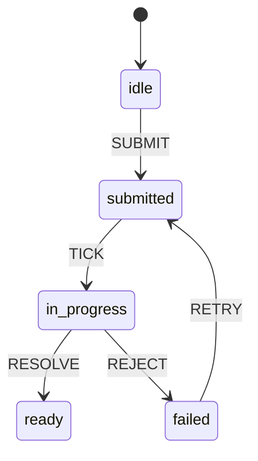
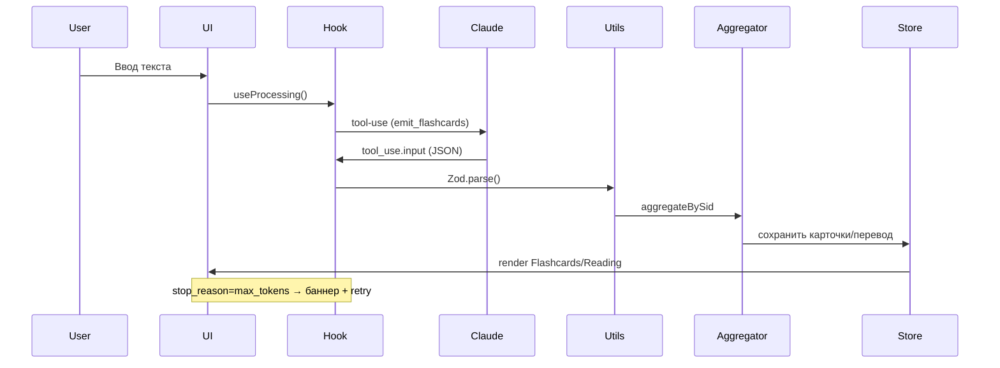

# 📖 Flashcards-v3 — Glossary (v5.1)

**Updated:** 2026-01-03

> Этот справочник фиксирует **термины и абстракции**, используемые в проекте `flashcards-v3`.  
> Цель: чтобы любой разработчик или агент (Codex/ChatGPT) читал TRS/планы/код и **не путался** в
> значениях.

---

## Архитектурные инварианты

- **Manifest-first** — порядок и состав предложений (Latvian LV) всегда определяется **манифестом**;
  никакой другой источник не имеет приоритета.
- **SID-aggregation** — агрегация результатов идёт по `SID` (sentence id), а не по порядку строк в
  JSONL или приходу ответов.
- **JSON-only via tools** — Claude/LLM всегда возвращает структурированный JSON через **наш tool**
  (`emit_flashcards`), парсинг и валидация обязательны.
- **Config-first** — никакие значения (тайминги, лимиты, хоткеи, модели, стили) не хардкодятся; всё
  из `/config/*.json` c валидацией Zod.
- **FSM-first** — процессы управляются конечными автоматами; UI — это **проекция FSM**.
- **Immediate errors** — любая ошибка (429, 413, 500, 529, network, expired, max_tokens) немедленно
  в баннер.

---

## Базовые сущности

- **Manifest (манифест)** — структура, которая описывает LV-текст как последовательность
  предложений. Каждое предложение имеет:
  - `sid` (sentence id) — детерминированный идентификатор, уникальный в рамках манифеста.
  - `lv` — оригинальное латышское предложение.
- **SID** — идентификатор предложения. Используется как ключ при агрегации, экспорте, отображении.
- **DTO** — Data Transfer Object. Структура данных (Zod-схема), описывающая формат между слоями (API
  ↔ UI).
- **Zod** — TypeScript-библиотека для валидации схем. Все входящие данные проходят через Zod.
- **FSM (Finite State Machine)** — конечный автомат, управляющий процессом (например, batch
  polling).
- **Pipeline (пайплайн)** — последовательность шагов обработки: ввод текста → split → manifest →
  batch/tool-use → агрегация → UI.
- **Retry (ретрай)** — повтор запроса при ошибках (max_tokens, 429/Retry-After, network).
  Экспоненциальный backoff + jitter.
- **Polling (поллинг)** — периодическая проверка статуса batch до готовности.
- **Prompt caching** — кэширование `system`+`tools` блоков для удешевления LLM-вызовов. Смена
  `tool_choice` может инвалидировать кеш.
- **Tool-use** — механизм Claude для JSON-only вывода. В проекте используется **один кастомный
  tool** `emit_flashcards`.

---

## Ошибки и stop reasons

- **Stop reason** — причина остановки генерации (`end_turn`, `tool_use`, `max_tokens`).
- **max_tokens**:
  - Если single-вызов: увеличиваем лимит и ретраим.
  - Если batch-вызов: сплитим проблемный чанк и ретраим его отдельно.
  - Частичный успех не блокирует UI — пользователь сразу видит то, что готово.
- **DoD (Definition of Done) риски** — если нарушены инварианты (например, данные пришли не
  JSON-only, потерян порядок SID, ошибки не показаны сразу) — задача **не считается выполненной**.
- **Expired batch** — батчи старше 29 дней становятся недоступными, UI показывает баннер и блокирует
  «Get results».

---

## Message Batches API

- **Message Batches API** — официальный Anthropic API для асинхронной пакетной обработки с 50%
  экономией. Результаты в формате JSONL.
- **Batch ID** — уникальный идентификатор батча (формат `msgbatch_XXXX`). Используется для получения
  статуса и результатов.
- **Batch Status** — состояние батча: `in_progress`, `canceling`, `ended`.
- **Request Counts** — счётчики запросов в батче: `processing`, `succeeded`, `errored`, `canceled`,
  `expired`.
- **Prompt Caching** — механизм кеширования стабильных частей промпта (`system`, `tools`).
  Используется `cache_control: { type: 'ephemeral' }` для пометки кешируемых блоков.
- **cache_control** — параметр в Anthropic API для управления кешированием. `ephemeral` означает
  временное кеширование (5 минут).
- **Processing Mode** — режим обработки в UI: Single (прямой API), Mock Batch (локальный), Message
  Batches (50% off).
- **Batch History** — история последних 10 батчей, хранится в localStorage через Zustand persist.

---

## Stores и хуки

- **Stores** — глобальное состояние: `CardStore`, `ContextStore`, `UiStore`, `flashcardsStore`,
  `batchHistoryStore`.
- **Hooks** — бизнес-логика в React (`useBatch`, `useProcessing`, `useLLMToolsEmitter`,
  `useMessageBatches`, `useFlashcards`, `useHotkeys`).
- **useBatch** — управляет пакетной обработкой: create → poll → fetch → aggregate.
- **useProcessing** — основной пайплайн: сегментация → чанки → вызовы Claude → агрегация.
- **useLLMToolsEmitter** — обёртка над LLM-вызовом с tools. Возвращает `ok/data/stopReason/error`.
- **useMessageBatches** — хук для работы с официальным Message Batches API. Управляет созданием,
  поллингом, отменой батчей и извлечением flashcards из результатов.
- **useFlashcards** — headless хук для управления состоянием flashcards (навигация, flip,
  visibility).
- **useHotkeys** — config-driven хук для регистрации горячих клавиш.
- **useErrorBanners** — централизованный диспетчер UI-ошибок.
- **batchHistoryStore** — Zustand store с persistence для хранения истории последних 10 батчей.
- **flashcardsStore** — Zustand store для состояния flashcards (cards, currentIndex, isFlipped).

---

## Агрегатор

- **Aggregator** — слой, который собирает результаты по `SID`, строит RU-текст и карточки.
- Гарантирует порядок предложений строго по манифесту.
- Поддерживает частичные успехи и догрузку после retry.

---

## Экспорт/импорт

- **JSON** — полный снапшот состояния (карточки, видимость, переводы).
- **JSONL** — формат батчей (каждая строка = `custom_id==SID`). Порядок строк игнорируется.
- **Export CSV/TSV** — для Anki/Quizlet (v1.3).

---

## Мини-диаграммы

### FSM (Batch)

### Tool-use цикл (emit_flashcards)

---

## TL;DR

- Manifest/SID — порядок предложений.
- Zod/DTO — строгие контракты.
- FSM — контролирует процессы.
- emit_flashcards — единственный tool (JSON-only).
- Stop reasons — max_tokens требует split/retry.
- Prompt caching — удешевление и стабильность.
- Aggregator — склеивает результаты по SID.
- DoD риски — невыполнение инвариантов = отказ.
