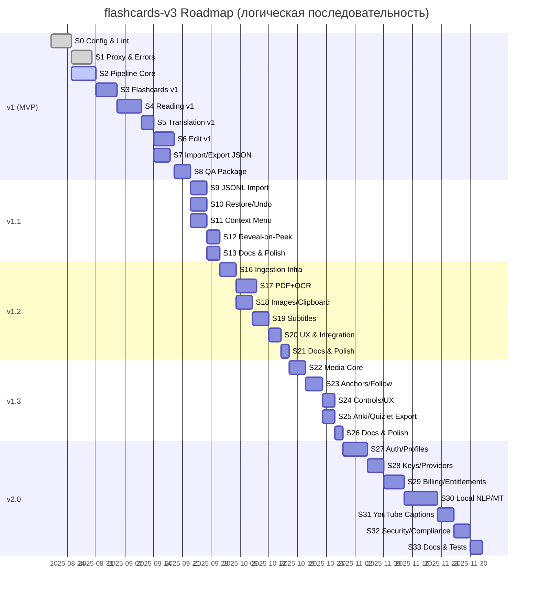

# Дорожная карта — **flashcards-v3**

Связка документов: **TRS v5.1** → `doc/trs/trs_v_5.md`, этапные планы → `doc/plan/plan_1..5.md`,
best-practices → `doc/best_practices/*` (включая `tool-use.md`,
`TechnicalGuidesForClaudeAPIv2.0.md`). Архитектурные инварианты неизменны на всех этапах:
**Manifest-first**, **SID-aggregation**, **FSM-first**, **tool-use JSON-only** + prompt-caching,
**config-first** (без хардкодов), i18n/themes, mobile-first, a11y.

---

## 0) Вектор и принципы

- Цепочка релизов: **v1 (MVP) → v1.1 → v1.2 → v1.3 → v2.0**.
- Приоритеты: надёжность batch-режима, детерминированность пайплайна, UX-прозрачность ошибок,
  производительность Reading/Flashcards, конфиги-first, локализация.
- Политика LLM: **все** вызовы через Claude **tools** (JSON-only), `tool_choice` фиксирует эмиттер;
  обрабатываем `stop_reason` (особенно `max_tokens`: bump/split-retry); prompt-caching для
  стабильных `system/tools`.

Status: S2 активен; выполнено ~70–75% (hooks/FSM/aggregation/config/error‑UX/tests). Tool‑use слой
не реализован (в очереди).

---

## 1) Свод по релизам

| Релиз        | Ключевые фичи                                                                                                                        | Артефакты             | Acceptance / Gates                                          |                       |                                             |
| ------------ | ------------------------------------------------------------------------------------------------------------------------------------ | --------------------- | ----------------------------------------------------------- | --------------------- | ------------------------------------------- |
| **v1 (MVP)** | Text/Flashcards/Reading/Translation/Edit; batch toggle; баннеры ошибок; i18n/themes; Import/Export JSON; конфиги+валидация; tool-use | `plan_1.md` (S0–S8)   | DoD plan_1 + TRS §5–§8/§12/§16–§18                          |                       |                                             |
| **v1.1**     | JSONL-импорт; Restore/Undo; контекстное меню (ПКМ/long-press); `reveal-on-peek`; телеметрия stop reasons                             | `plan_2.md` (S9–S13)  | DoD plan_2 + TRS §6/§9/§10/§15/§19                          |                       |                                             |
| **v1.2**     | Ingestion: **PDF/OCR/Images/Subtitles/Clipboard**; единый Manifest (SID); lazy/worker; локализация UI                                | `plan_3.md` (S16–S21) | DoD plan_3 + TRS §4/§6/§12/§16/§21                          |                       |                                             |
| **v1.3**     | Media follow-highlight; Anchors↔Reading; хоткеи/жесты; экспорт **Anki/Quizlet**                                                     | `plan_4.md` (S22–S26) | DoD plan_4 + TRS §5/§6/§13/§16/§19                          |                       |                                             |
| **v2.0**     | Профили/подписки/синхронизация; Keys-Vault; \`pipeline.mode = llm                                                                    | local                 | hybrid\`; локальные **Lemma/Dict/MT**; **YouTube Captions** | `plan_5.md` (S27–S34) | DoD plan_5 + TRS §6/§12/§13/§20–§21/§23–§24 |

> Приоритет внутренних доков: оф. Anthropic → `TechnicalGuidesForClaudeAPIv2.0.md` → `tool-use.md` →
> `Message Batches.md` / `MessageBatches2.md`.

---

## 2) Зависимости и порядок

### 2.1 Критические зависимости

- **Batch & ошибки (v1)** ← прокси/health + политика ретраев (`Retry-After`, backoff+jitter).
- **Tool-use JSON-only** (v1) ← валидаторы Zod, строгие DTO, кеширование `system/tools`.
- **Reveal-on-peek (v1.1)** ← стабильный tooltip-controller (delay/debounce/cancel/single-flight).
- **Ingestion (v1.2)** ← единый Manifest/SID и сегментация `latvian_sentence_tester:local`.
- **Media follow-highlight (v1.3)** ← anchors из субтитров (v1.2) и Reading Highlighter.
- **Профили/лимиты (v2.0)** ← устойчивые экспорт/импорт, версии схем/конфигов.

### 2.2 Диаграмма (Mermaid Gantt)



Status snapshot: S0, S1 ✅; S2 implemented & under review; next S3. S34 Polish & Release : s34,
after s33, 2d

```

> Даты условны; фактический календарь уточняется по состоянию репозитория и ресурсам.

---

## 3) KPI и целевые метрики

### 3.1 Надёжность/Batch

- **Batch success rate ≥ 97%** (исключая невалидный ввод).
- **TTE Banner (proxy/network down) < 300 мс** — мгновенное оповещение.
- **Stop reasons обработаны**: `max_tokens` → bump/split-retry; `tool_use`/`pause_turn` корректно
  идентифицированы.
- **Уважение `Retry-After`** + backoff+jitter на фронте и прокси.

### 3.2 Производительность/UX

- **TTI Flashcards/Reading ≤ 1.5 с** (cold ≤ 2.5 с).
- **Tooltip P95 render ≤ 50 мс** после истечения `showDelayMs`.
- Виртуализация списков при > 200 карточек на страницу; single-flight подсказок.

### 3.3 Данные/Качество

- **Export → Re-import fidelity = 100%** (бит-в-бит состояние).
- **i18n coverage ≥ 98%**, fallback `en` без пропусков.
- **Config docs coverage = 100%** (`CONFIG_INDEX.md`).

### 3.4 Качество кода/Тесты

- **Unit coverage ≥ 70%** критических модулей (tooltip, merge, reducers, JSONL/OCR parsers).
- **E2E pass-rate ≥ 95%** на CI.
- **Zero hardcode violations** (скрипт `lint:anti-hardcode`, ESLint **codeframe**).

---

## 4) RACI

| Область                  | R (исполняет) | A (отвечает) | C (консультирует) | I (информируется) |
| ------------------------ | ------------- | ------------ | ----------------- | ----------------- |
| Прокси/API/Batch         | Backend Eng   | Tech Lead    | QA, PM            | Все               |
| Tool-use/Adapters        | Core Eng      | Tech Lead    | Backend           | Все               |
| Pipeline/Stores/Manifest | Core Eng      | Tech Lead    | Frontend          | Все               |
| UI режимы (v1–v1.3)      | Frontend Eng  | Tech Lead    | UX, QA            | Все               |
| Ingestion/OCR/Subtitles  | Frontend+Core | Tech Lead    | Backend           | Все               |
| Media/Player/Export      | Frontend      | Tech Lead    | Core              | Все               |
| Профили/Биллинг/Keys     | Backend       | Tech Lead    | Legal/Finance     | Все               |
| Конфиги/Документация     | Все           | Tech Lead    | QA                | Все               |

---

## 5) Риски и меры

- **Anthropic 429/529/перегруз** → бэкофф + `Retry-After`, частичные результаты не блокируются;
  офлайн JSONL-импорт.
- **`max_tokens` как stop, не ошибка** → мягкие ретраи (bump/split-retry), баннер+кнопка Retry.
- **Производительность OCR/Media** → web-workers, ограничение параллелизма, возможность отключить
  follow-highlight.
- **Разнообразие субтитров** → tolerant-парсеры, нормализация, логи проблемных строк.
- **Безопасность профилей/ключей (v2.0)** → шифрование AES-GCM, HttpOnly, audit-лог, минимум логов.
- **i18n-долги** → линт на «сырые» строки, блок PR, словарный реестр.
- **Блокер S2:** Tool‑use слой не реализован; блокирует end‑to‑end карточки от Claude.

---

## 6) Go/No-Go (выпускные ворота)

- **v1 (MVP):** пройдены S0–S8; KPI §3.1–§3.4 ≥ порогов; ошибок P0/P1 — нет.
- **v1.1:** надёжный JSONL-импорт, Restore/Undo восстанавливают идентичное состояние; контекст-меню
  безопасно (`allowedHosts`).
- **v1.2:** любой источник (PDF/Image/Clipboard/Subtitles) → корректный Manifest (SID); UI
  дружелюбен на mobile.
- **v1.3:** follow-highlight устойчив; экспорт Anki/Quizlet валиден по эталонным наборам.
- **v2.0:** профили/лимиты/ключи защищены; локальный MT выполняет SLA; YouTube Captions соблюдает
  TOS.

---

## 7) Артефакты и трассируемость

- **TRS:** `doc/trs/trs_v_5.md` (источник критериев приёмки).
- **Планы:** `doc/plan/plan_1..5.md`.
- **Best-Practices:** `doc/best_practices/*` (incl. `tool-use.md`,
  `TechnicalGuidesForClaudeAPIv2.0.md`).
- **Конфиги:** `config/*.json` + схемы; реестр → `doc/configs/CONFIG_INDEX.md`.
- **Диаграммы:** `doc/architecture*.mmd` (обновление по итогам ключевых спринтов).

---

## 8) Следующие шаги

1. Уточнить длительности спринтов на основе текущего прогресса репозитория.
2. Включить CI-пайплайн: `lint (codeframe)`, `test`, `e2e`, `validate:config`, отчёт KPI.
3. Назначить RACI-владельцев и календарь RC-билдов.
4. Провести ревизию i18n-ключей и конфиг-доков перед freeze каждого этапа.
5. Зафиксировать «инвариантные» блоки prompt-caching (`system/tools`) для стабильной стоимости в
   v1+.

> Все дополнения и изменения дорожной карты синхронизируются с TRS и соответствующим `plan_X.md`;
> при конфликте приоритет у TRS v5.1 и official Anthropic docs.
```
