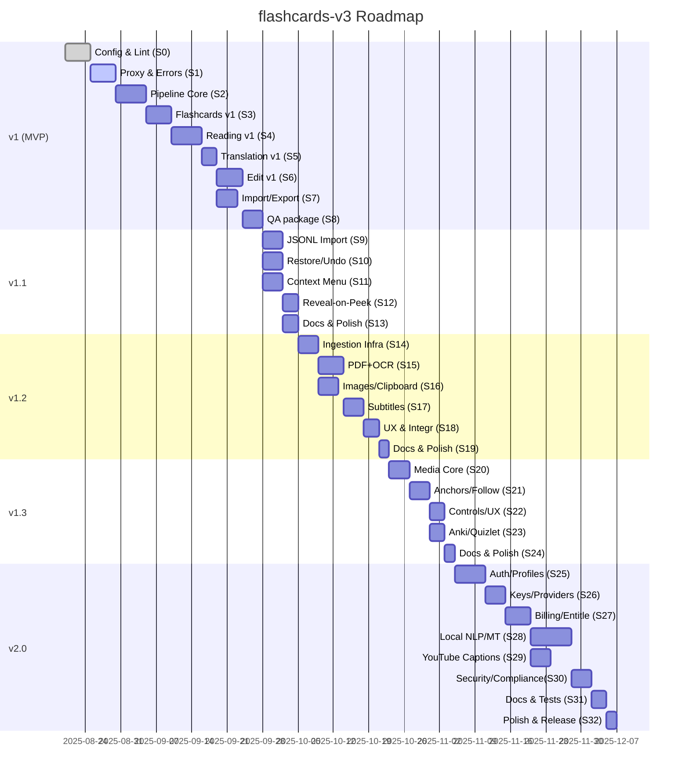

# Дорожная карта — flashcards‑v3

Связка: **TRS v5.0** + планы **plan1.md…plan5.md**

## 0) Обзор и принципы

- Релиз-цепочка: **MVP v1 → v1.1 → v1.2 → v1.3 → v2.0**.
- Приоритет: надёжность batch‑режима, конфиги‑first, производительность Reading, UX‑прозрачность
  ошибок, мобильная дружелюбность.
- Жёсткие входные ворота на каждый релиз: DoD + Acceptance из ТЗ + KPI.

---

## 1) Свод по релизам

| Релиз        | Ключевые фичи                                                                                                              | Основные артефакты | Acceptance/Gates             |
| ------------ | -------------------------------------------------------------------------------------------------------------------------- | ------------------ | ---------------------------- |
| **v1 (MVP)** | Text/Flashcards/Reading/Translation/Edit; batch toggle; баннеры ошибок; i18n/themes; Import/Export JSON; конфиги+валидация | plan1.md S0–S8     | DoD plan1 + §17 ТЗ           |
| **v1.1**     | JSONL‑импорт; Restore/Undo; контекстное меню в Reading; reveal‑on‑peek                                                     | plan2.md S9–S13    | DoD plan2 + доп. §8/§11 ТЗ   |
| **v1.2**     | Ingestion: PDF/OCR/Images/Subtitles                                                                                        | plan3.md S14–S19   | DoD plan3 + §21 ТЗ           |
| **v1.3**     | Media follow‑highlight; экспорт Anki/Quizlet                                                                               | plan4.md S20–S24   | DoD plan4 + §22/§19.2 ТЗ     |
| **v2.0**     | Профили/подписки/синхронизация; локальный NLP/MT; YouTube captions                                                         | plan5.md S25–S32   | DoD plan5 + §23/§24/§21.6 ТЗ |

---

## 2) Зависимости и порядок

### 2.1 Критические зависимости

- **Batch & ошибки (v1)** ← базовый прокси, health‑чек, баннеры.
- **Reveal‑on‑peek (v1.1)** ← стабильный tooltip controller (delay/cancel/single‑flight) из v1.
- **Ingestion (v1.2)** ← единый Manifest/SID из v1.
- **Media follow‑highlight (v1.3)** ← anchors в манифесте субтитров (v1.2) и Reading Highlighter.
- **Профили/подписки (v2.0)** ← стабильные экспорт/импорт (v1), схемы данных.

### 2.2 Граф зависимостей (Mermaid)

> Даты в диаграмме ориентировочные (старт = 2025‑08‑20, можно сдвигать). Продолжительности
> уточняются по факту.

---

## 3) KPI и целевые метрики

### 3.1 Надёжность/ошибки

- **Batch success rate ≥ 97%** (без учёта входных ошибок пользователя).
- **Mean time‑to‑error banner < 300 ms** при down прокси/сети.
- **Корректная обработка 429/413/500/529**: ретрай с backoff, не блокируя UI.

### 3.2 Производительность

- **TTI режима Flashcards/Reading < 1.5 s** на средних устройствах, cold‑start < 2.5 s.
- **Tooltip P95 render < 50 ms** (после истечения `showDelayMs`).
- Виртуализация списков при > 200 карточек/страницу.

### 3.3 Качество данных

- **Export→Re‑import fidelity = 100%** (бит‑в‑бит состояние).
- **i18n coverage ≥ 98%** ключей UI.
- **Config docs coverage = 100%** по реестру `CONFIG_INDEX.md`.

### 3.4 Тесты/качество кода

- **Unit coverage ≥ 70%** критических модулей (tooltip, merge, reducers, parsеры).
- **E2E стабильность ≥ 95%** прохождений на CI.
- **Zero hardcode violations** (линт `lint:anti-hardcode`).

---

## 4) RACI (ответственность)

| Область              | R (исполняет) | A (отвечает) | C (консультирует) | I (информируется) |
| -------------------- | ------------- | ------------ | ----------------- | ----------------- |
| Прокси/API/Batch     | Backend Eng   | Tech Lead    | QA, PM            | Все               |
| Pipeline/Stores      | Core Eng      | Tech Lead    | Backend           | Все               |
| UI режимы            | Frontend Eng  | Tech Lead    | UX, QA            | Все               |
| Ingestion/OCR        | Frontend+Core | Tech Lead    | Backend           | Все               |
| Media/Player         | Frontend      | Tech Lead    | Core              | Все               |
| Профили/Биллинг      | Backend       | Tech Lead    | Legal/Finance     | Все               |
| Конфиги/Документация | Все           | Tech Lead    | QA                | Все               |

---

## 5) Риски и планы реагирования

- **Перегруз Anthropic (529)** → бэкофф + офлайн JSONL импорт; информирование пользователя.
- **Производительность OCR/Media** → web‑workers, ограничение параллельности, отключаемые фичи.
- **Дефицит i18n ключей** → линт на «сырые» строки, блок PR.
- **Сложность схем экспорта** → фиксированные маппинги и тест‑наборы импорта в Anki/Quizlet.
- **Безопасность профилей/ключей** (v2.0) → шифрование, аудит, ограничение логов.

---

## 6) Контрольные точки (Go/No‑Go)

- **MVP v1:** пройдены S0–S8, метрики §3.1–§3.4 > порогов; нет критических дефектов P0/P1.
- **v1.1:** JSONL импорт надёжен, Restore/Undo возвращают идентичное состояние; ПКМ меню безопасно
  (allowedHosts).
- **v1.2:** PDF/OCR/Images/Subtitles формируют корректный Manifest; UI дружелюбен на mobile.
- **v1.3:** Follow‑highlight устойчив; экспорт Anki/Quizlet валиден по эталонным наборам.
- **v2.0:** Профили/лимиты/ключи защищены; локальный MT работает в заявленных ограничениях; YouTube
  Captions соблюдает TOS.

---

## 7) Артефакты и трассируемость

- ТЗ: TRS v5.0 (канвас).
- Планы: plan1.md … plan5.md (канвас).
- Конфиг‑реестр: `/docs/configs/CONFIG_INDEX.md`.
- Диаграммы: `/docs/architecture.mmd` (обновлять по окончании S2, S18, S24, S32).

---

## 8) Следующие действия

- Уточнить оценки длительностей спринтов с учётом фактического прогресса репозитория.
- Подготовить CI‑воркфлоу: `lint`, `test`, `e2e`, `validate:config`, отчёт KPI.
- Назначить владельцев по RACI и расписать календарь релиз‑кандидатов.
